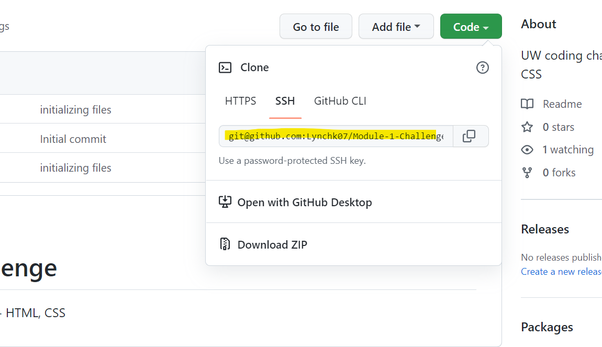

# Title: Module-1-Challenge 
UW coding challege Module 1 - HTML, CSS 

# Description: 
This is code for a class assignment to refactor code to meet accessibility standards and follow semantic HTML elements. 

## Acceptance Criteria for this project:

* GIVEN a webpage meets accessibility standards
* WHEN I view the source code
* THEN I find semantic HTML elements
* WHEN I view the structure of the HTML elements
* THEN I find that the elements follow a logical structure independent of styling and positioning
* WHEN I view the image elements
* THEN I find accessible alt attributes
* WHEN I view the heading attributes
* THEN they fall in sequential order
* WHEN I view the title element
* THEN I find a concise, descriptive title

# Web Addresses: 
https://github.com/Lynchk07/Module-1-Challenge.git

# GITHub: 
git@github.com:Lynchk07/Module-1-Challenge.git

# Installation: 

* Creat your own respository in Github with a README File. 
* USE GITBASH or Terminal to  git pull your repository from GitHub.
* You can also use VS code and pull directly in using gitbash or terminal, as well. 

